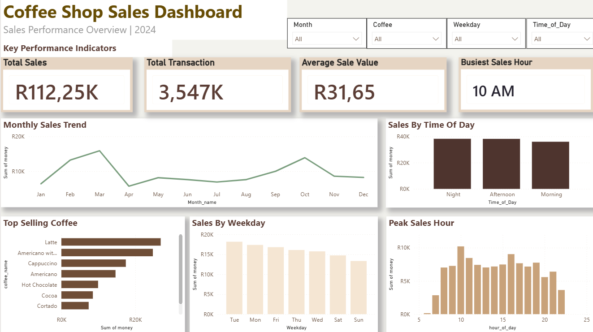

# ☕ Coffee Shop Sales Analysis Dashboard

## 📌 Project Overview

This project presents an interactive Power BI dashboard built to analyze coffee shop sales performance. The data was cleaned and prepared in Microsoft Excel before being transformed into meaningful visual insights using Power BI.

The dashboard helps identify sales trends, customer purchasing behaviour, product performance, and peak business hours, enabling better business decision-making.

---

## 🎯 Project Objectives

- Analyze overall sales performance.
- Identify the best-selling coffee products.
- Monitor monthly sales trends.
- Understand customer payment preferences.
- Determine peak business hours.
- Present business insights through an interactive dashboard.

---

## 🛠️ Tools Used

- **Microsoft Excel** – Data cleaning and preparation
- **Power BI** – Data modelling, DAX measures, and dashboard development
- **GitHub** – Project documentation and portfolio

---

## 📊 Dashboard Features

- Total Revenue KPI
- Total Transactions KPI
- Average Transaction Value
- Monthly Sales Trend
- Sales by Hour
- Sales by Weekday
- Sales by Coffee Product
- Payment Method Distribution

---

## 🔍 Key Insights

- Revenue fluctuates across different months, revealing seasonal sales trends.
- Certain coffee products consistently outperform others in sales.
- Customer activity peaks during specific hours of the day.
- Payment methods show clear customer purchasing preferences.
- Weekly sales patterns can support staffing and inventory planning.

---

## 💡 Business Recommendations

- Schedule more staff during peak sales hours.
- Ensure top-selling products remain well stocked.
- Introduce promotions during slower business periods.
- Use monthly sales trends to improve inventory planning.
- Monitor customer payment behaviour to support operational decisions.

---

## 📁 Repository Contents

- `Coffee_shop.sales.pbix` – Power BI dashboard
- `Coffee_shop.sales.csv` – Dataset
- `Coffee_Shop_Sales_Dashboard_Report.pdf` – Project report
- `dashboard.png` – Dashboard screenshot

---

## 🚀 Skills Demonstrated

- Data Cleaning
- Data Transformation
- Power BI Dashboard Design
- KPI Development
- Data Visualization
- Business Intelligence
- Analytical Thinking
- Data Storytelling

---

## 👤 Author

**Sandy Moseru**

Aspiring Data Analyst passionate about transforming data into actionable business insights.

### Connect with me

- LinkedIn: *(https://www.linkedin.com/in/sandy-moseru-5936a5241/)*
- GitHub: https://github.com/Sandy-With-Data56

---

⭐ If you found this project useful or interesting, feel free to star this repository.
